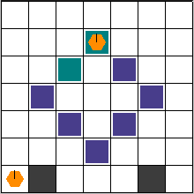

<p align="center">
 
 <p align="center">A multi-agent reinforcement learning environment</p>
</p>

[](https://GitHub.com/Naereen/StrapDown.js/graphs/commit-activity)
[](https://github.com/Naereen/StrapDown.js/blob/master/LICENSE)

<h1>Table of Contents</h1>

- [Environment Description](#environment-description)
  - [What does it look like?](#what-does-it-look-like)
  - [Action Space](#action-space)
  - [Observation Space](#observation-space)
  - [Dynamics: Collisions](#dynamics-collisions)
  - [Rewards](#rewards)
- [Environment Parameters](#environment-parameters)
  - [Naming Scheme](#naming-scheme)
  - [Custom layout](#custom-layout)
- [Installation](#installation)
- [Getting Started](#getting-started)
- [Please Cite](#please-cite)


# Environment Description

The multi-robot warehouse (RWARE) environment simulates a warehouse with robots moving and delivering requested goods. The simulator is inspired by real-world applications, in which robots pick-up shelves and deliver them to a workstation. Humans access the content of a shelf, and then robots can return them to empty shelf locations.

The environment is configurable: it allows for different sizes (difficulty), number of agents, communication capabilities, and reward settings (cooperative/individual). Of course, the parameters used in each experiment must be clearly reported to allow for fair comparisons between algorithms.

## What does it look like?

Below is an illustration of a small (10x20) warehouse with four trained agents. Agents have been trained with the SEAC algorithm [[2](#please-cite)]. This visualisation can be achieved using the `env.render()` function as described later.

<p align="center">
 
</p>


## Action Space
In this simulation, robots have the following discrete action space:

A={ Turn Left, Turn Right, Forward, Load/Unload Shelf }

The first three actions allow each robot only to rotate and move forward. Loading/Unloading only works when an agent is beneath a shelf on one of the predesignated locations.

## Observation Space
The observation of an agent is partially observable and consists of a 3x3 (configurable) square centred on the agent. Inside this limited grid, all entities are observable:
- The location, the rotation and whether the agent is carrying a shelf.
- The location and rotation of other robots.
- Shelves and whether they are currently in the request queue.

## Dynamics: Collisions
The dynamics of the environment are also of particular interest. Like a real, 3-dimensional warehouse, the robots can move beneath the shelves. Of course, when the robots are loaded, they must use the corridors, avoiding any standing shelves.

Any collisions are resolved in a way that allows for maximum mobility. When two or more agents attempt to move to the same location, we prioritise the one that also blocks others. Otherwise, the selection is done arbitrarily. The visuals below demonstrate the resolution of various collisions.

 Example 1                 |   Example 2               | Example 3
:-------------------------:|:-------------------------:|:-------------------------:
  |    |  

## Rewards
At each time a set number of shelves R is requested. When a requested shelf is brought to a goal location, another shelf is uniformly sampled and added to the current requests. Agents are rewarded for successfully delivering a requested shelf to a goal location, with a reward of 1. A significant challenge in these environments is for agents to deliver requested shelves but also finding an empty location to return the previously delivered shelf. Having multiple steps between deliveries leads a very sparse reward signal.

# Environment Parameters

The multi-robot warehouse task is parameterised by:

- The size of the warehouse which is preset to either tiny (10x11), small (10x20), medium (16x20), or large (16x29).
- The number of agents N.
- The number of requested shelves R. By default R=N, but easy and hard variations of the environment use R = 2N and R = N/2, respectively.

Note that R directly affects the difficulty of the environment. A small R, especially on a larger grid, dramatically affects the sparsity of the reward and thus exploration: randomly bringing the correct shelf becomes increasingly improbable.

## Naming Scheme

While RWARE allows fine tuning of multiple parameters when using the Warehouse class, it also registers multiple default environments with Gym for simplicity.

The registered names look like `rware-tiny-2ag-v1` and might cryptic in the beginning, but it is not actually complicated. Every name always starts with rware. Next, the map size is appended as -tiny, -small, -medium, or -large. The number of robots in the map is selected as Xag with X being a number larger than one (e.g. -4ag for 4 agents). A difficulty modifier is optionally appended in the form of -easy or -hard, making requested shelves twice or half the number of agents (see section Rewards). Finally -v1 is the version as required by OpenAI Gym. In the time of writing all environments are v1, but we will increase it during changes or bugfixes.

A few examples:
```python
env = gym.make("rware-tiny-2ag-v1")
env = gym.make("rware-small-4ag-v1")
env = gym.make("rware-medium-6ag-hard-v1")
```


Of course, more settings are available, but have to be changed during environment creation. For example:
```python
env = gym.make("rware-tiny-2ag-v1", sensor_range=3, request_queue_size=6)
```

## Custom layout
You can design a custom warehouse layout with the following:
```python
layout = """
.......
...x...
..x.x..
.x...x.
..x.x..
...x...
.g...g.
"""
gym = env.make("rware:rware-tiny-2ag-v1", layout=layout)
```
This will transform "X"s to shelves and "G"s to goal locations with a result like the one below:
<p align="center">
 
</p>


A detailed explanation of all parameters can be found [here](https://github.com/semitable/robotic-warehouse/blob/4307b1fe3afa26de4ca4003fd04ab1319879832a/robotic_warehouse/warehouse.py#L132)

# Installation

Assuming you have Python3 (preferably on a virtual environment: venv or Anaconda) installed, you can use PyPI:
```sh
pip install rware
```

If you prefer to have the code available and be able to edit it, you can use Git to download and install it:
```sh
git clone git@github.com:uoe-agents/robotic-warehouse.git
cd robotic-warehouse
pip install -e .
```

# Getting Started

RWARE was designed to be compatible with Open AI's Gym framework.

Creating the environment is done exactly as one would create a Gym environment:

```python
import gym
import rware
env = gym.make("rware-tiny-2ag-v1")
```

You can even bypass the `import` statement with Gym, and directly use:
```python
import gym
env = gym.make("rware:rware-tiny-2ag-v1")
```
The `rware:` in the beginning of the environment name tells Gym to import the respective package.

The number of agents, the observation space, and the action space are accessed using:
```python
env.n_agents  # 2
env.action_space  # Tuple(Discrete(5), Discrete(5))
env.observation_space  # Tuple(Box(XX,), Box(XX,))
```

The returned spaces are from the Gym library (`gym.spaces`) Each element of the tuple corresponds to an agent, meaning that `len(env.action_space) == env.n_agents` and `len(env.observation_space) == env.n_agents` are always true.

The reset and step functions again are identical to Gym:

```python
obs = env.reset()  # a tuple of observations

actions = env.action_space.sample()  # the action space can be sampled
print(actions)  # (1, 0)
n_obs, reward, done, info = env.step(actions)

print(done)    # [False, False]
print(reward)  # [0.0, 0.0]
```
which leaves as to the only difference with Gym: the rewards and the done flag are lists, and each element corresponds to the respective agent.

Finally, the environment can be rendered for debugging purposes:
```python
env.render()
```
and should be closed before terminating:
```python
env.close()
```


# Please Cite
If you use this environment, consider citing
1. A comperative evaluation of MARL algorithms that includes this environment
```
@inproceedings{papoudakis2021benchmarking,
   title={Benchmarking Multi-Agent Deep Reinforcement Learning Algorithms in Cooperative Tasks},
   author={Georgios Papoudakis and Filippos Christianos and Lukas Schäfer and Stefano V. Albrecht},
   booktitle = {Proceedings of the Neural Information Processing Systems Track on Datasets and Benchmarks (NeurIPS)},
   year={2021},
   url = {http://arxiv.org/abs/2006.07869},
   openreview = {https://openreview.net/forum?id=cIrPX-Sn5n},
   code = {https://github.com/uoe-agents/epymarl},
}
```
2. A method that achieves state-of-the-art performance in the robotic warehouse task
```
@inproceedings{christianos2020shared,
 author = {Christianos, Filippos and Sch\"{a}fer, Lukas and Albrecht, Stefano},
 booktitle = {Advances in Neural Information Processing Systems},
 editor = {H. Larochelle and M. Ranzato and R. Hadsell and M. F. Balcan and H. Lin},
 pages = {10707--10717},
 publisher = {Curran Associates, Inc.},
 title = {Shared Experience Actor-Critic for Multi-Agent Reinforcement Learning},
 url = {https://proceedings.neurips.cc/paper/2020/file/7967cc8e3ab559e68cc944c44b1cf3e8-Paper.pdf},
 volume = {33},
 year = {2020}
}

```

